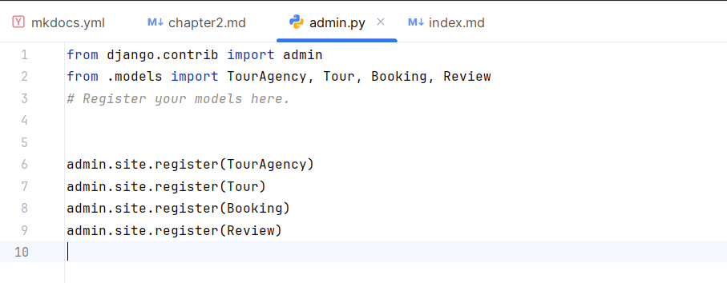

# Контроллеры views

Дальше нужно зарегистрировать таблицы модели данных в админ-панели.


Создаю в файле views.py (находится в папке приложения) представление (контроллер), который выводит из базы данных данные о владельце автомобиля. 
Все контроллеры связываю с html страничками.

**код из файла view.py:**
```python
from django.contrib import messages
from django.contrib.auth import logout
from django.contrib.auth import login, authenticate
from django.contrib.auth.forms import AuthenticationForm
from django.shortcuts import render, redirect, get_object_or_404
from django.contrib.auth.decorators import login_required
from .forms import UserRegistrationForm, BookingForm, ReviewForm, TourFilterForm
from .models import Tour, Booking
from django.db.models import Count

# Create your views here.
def login_view(request):
    if request.method == 'POST':
        form = AuthenticationForm(request, data=request.POST)
        if form.is_valid():
            username = form.cleaned_data.get('username')
            password = form.cleaned_data.get('password')
            user = authenticate(request, username=username, password=password)
            if user is not None:
                login(request, user)
                # Перенаправление к 'next' или на 'tour_list' по умолчанию
                next_url = request.GET.get('next', 'tour_list')
                return redirect(next_url)
            else:
                messages.error(request, "Invalid username or password.")
        else:
            messages.error(request, "Invalid username or password.")
    else:
        form = AuthenticationForm()
    return render(request, 'log_in.html', {'form': form})

def register(request):
    if request.method == 'POST':
        form = UserRegistrationForm(request.POST)
        if form.is_valid():
            user = form.save(commit=False)
            user.set_password(form.cleaned_data['password'])
            user.save()
            login(request, user)
            return redirect('tour_list')
    else:
        form = UserRegistrationForm()
    return render(request, 'register.html', {'form': form})

def tour_list(request):
    tours = Tour.objects.filter(available_seats__gt=0)  # Only get tours with available seats
    form = TourFilterForm(request.GET)
    if form.is_valid():
        name = form.cleaned_data.get('name')
        start_date = form.cleaned_data.get('start_date')
        end_date = form.cleaned_data.get('end_date')
        if name:
            tours = tours.filter(name__icontains=name)
        if start_date:
            tours = tours.filter(start_date__gte=start_date)
        if end_date:
            tours = tours.filter(end_date__lte=end_date)
    context = {
        'tours': tours,
        'form': form
    }
    return render(request, 'tour_list.html', context)


def sold_tours_by_country(request):
    # Fetch sold out tours (those with no available seats)
    sold_tours = Tour.objects.filter(available_seats=0)

    context = {
        'sold_tours': sold_tours  # Pass the sold tours to the context
    }
    return render(request, 'sold_tours_by_country.html', context)

@login_required(login_url='register')  # Перенаправляем на страницу регистрации, если пользователь не авторизован
def tour_detail(request, tour_id):
    tour = get_object_or_404(Tour, id=tour_id)
    booking = Booking.objects.filter(user=request.user, tour=tour, is_confirmed=True).first()
    reviews = tour.reviews.all()
    context = {
        'tour': tour,
        'agency': tour.agency,
        'reviews': reviews,
        'average_rating': tour.average_rating if tour.average_rating is not None else "No reviews yet",
        'booking_confirmed': booking is not None,
    }
    return render(request, 'tour_info.html', context)
@login_required
def add_review(request, tour_id):
    tour = get_object_or_404(Tour, id=tour_id)
    booking = Booking.objects.filter(user=request.user, tour=tour, is_confirmed=True).first()
    if not booking:
        messages.error(request, "You can't add a review, your booking is not confirmed.")
        return redirect('tour_detail', tour_id=tour_id)
    if request.method == 'POST':
        form = ReviewForm(request.POST)
        if form.is_valid():
            review = form.save(commit=False)
            review.user = request.user
            review.tour = tour
            review.save()
            messages.success(request, "Thank you for your review.!")
            return redirect('tour_detail', tour_id=tour_id)
    else:
        form = ReviewForm()

    return render(request, 'add_review.html', {'form': form, 'tour': tour})


@login_required
def book_tour(request, tour_id):
    tour = get_object_or_404(Tour, id=tour_id)

    # Check if there are available seats
    if tour.available_seats > 0:
        if request.method == 'POST':
            form = BookingForm(request.POST)
            if form.is_valid():
                booking = form.save(commit=False)
                booking.user = request.user
                booking.tour = tour
                booking.save()
                tour.available_seats -= 1
                tour.save()
                messages.success(request, "Tour booked successfully!")
                return redirect('tour_list')
        else:
            form = BookingForm()
    else:
        # If no seats available, allow booking
        if request.method == 'POST':
            form = BookingForm(request.POST)
            if form.is_valid():
                booking = form.save(commit=False)
                booking.user = request.user
                booking.tour = tour
                booking.save()
                messages.info(request, "Tour sold out, but your booking is recorded.")
                return redirect('tour_list')
        else:
            form = BookingForm()

    return render(request, 'book_tour.html', {'form': form, 'tour': tour})

@login_required
def add_review(request, tour_id):
    tour = get_object_or_404(Tour, id=tour_id)
    if request.method == 'POST':
        form = ReviewForm(request.POST)
        if form.is_valid():
            review = form.save(commit=False)
            review.user = request.user
            review.tour = tour
            review.save()
            return redirect('tour_detail', tour_id=tour_id)
    else:
        form = ReviewForm()
    return render(request, 'add_review.html', {'form': form, 'tour': tour})

@login_required
def my_bookings(request):
    bookings = Booking.objects.filter(user=request.user)
    return render(request, 'my_bookings.html', {'bookings': bookings})

@login_required
def edit_booking(request, booking_id):
    booking = get_object_or_404(Booking, id=booking_id, user=request.user)
    if request.method == 'POST':
        form = BookingForm(request.POST, instance=booking)
        if form.is_valid():
            form.save()
            return redirect('my_bookings')
    else:
        form = BookingForm(instance=booking)
    return render(request, 'edit_booking.html', {'form': form})

@login_required
def delete_booking(request, booking_id):
    booking = get_object_or_404(Booking, id=booking_id, user=request.user)
    if request.method == 'POST':
        booking.delete()
        return redirect('my_bookings')
    return render(request, 'delete_booking.html', {'booking': booking})

@login_required
def add_review(request, tour_id):
    tour = get_object_or_404(Tour, id=tour_id)
    if request.method == 'POST':
        form = ReviewForm(request.POST)
        if form.is_valid():
            review = form.save(commit=False)
            review.user = request.user
            review.tour = tour
            review.save()
            return redirect('tour_detail', tour_id=tour.id)
    else:
        form = ReviewForm()
    return render(request, 'add_review.html', {'form': form, 'tour': tour})

def custom_logout(request):
    logout(request)
    return redirect('tour_list')
```
