# Получившийся проект

Запускаю проект и захожу http://127.0.0.1:8000/
На странице появляется информация о доступных турах, можно применить фильтр.
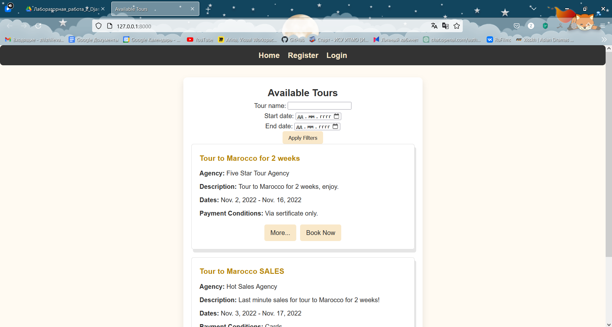
При попытке посмотреть информацию о турах, когда пользователь не зарегистрирован, его перебрасывает на страницу регистрации.
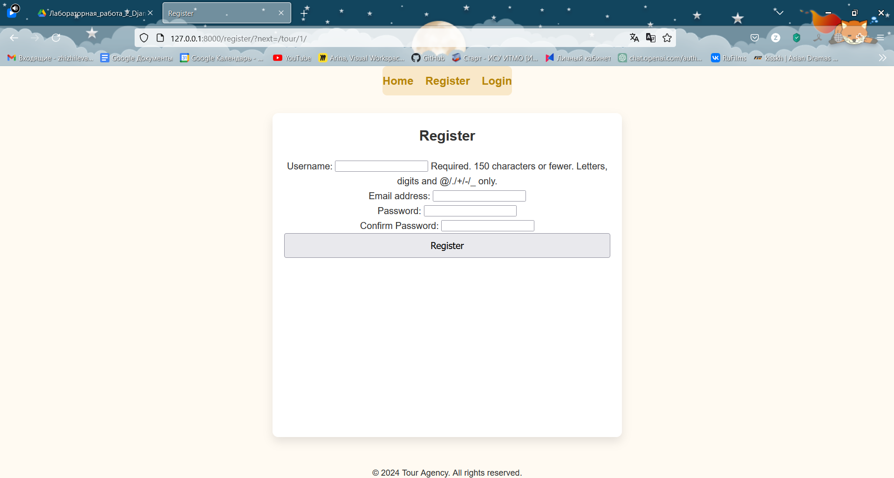
Можно войти в существующий аккаунт
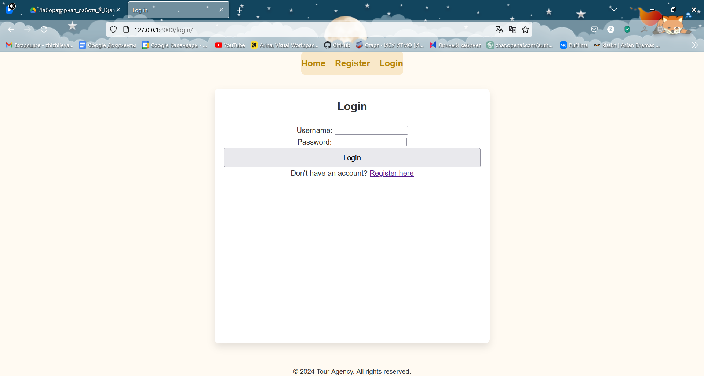
После регистрации мы сможем посмотреть информацию о турах и забронировать тур. 
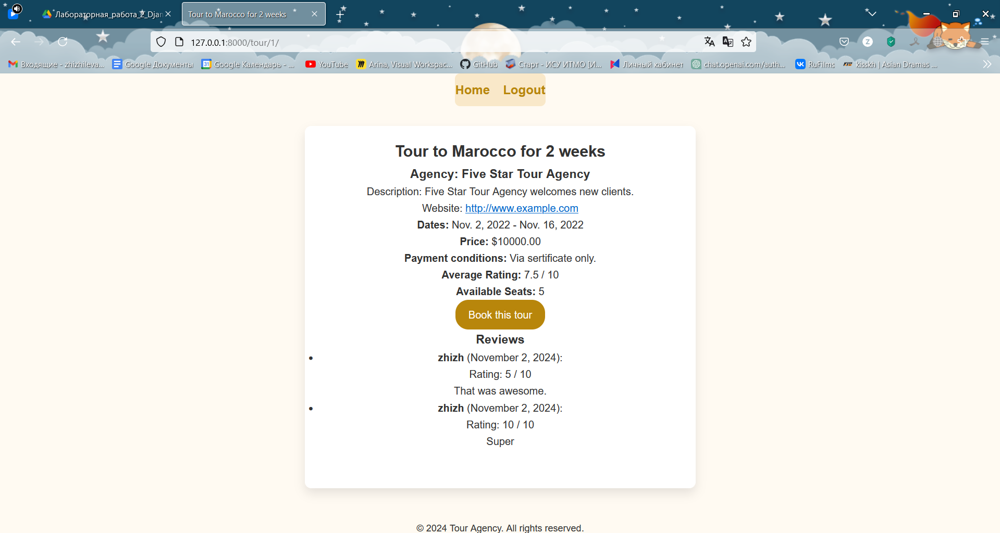
Во время брони мы можем выбрать места.
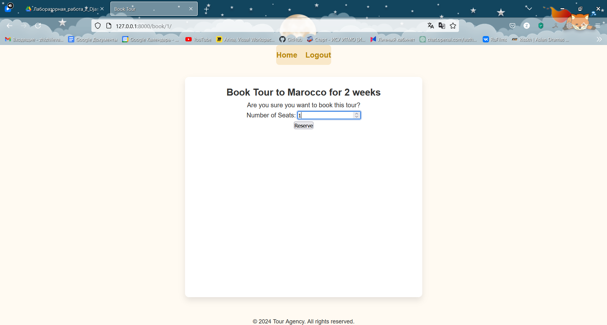
После бронирования мы можем перейти в наш профиль и увидеть бронирования.
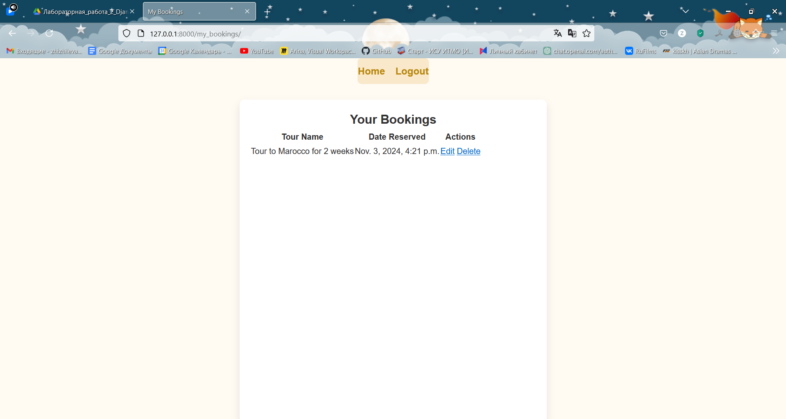
В нашем профиле мы можем изменить бронирование или удалить его. 
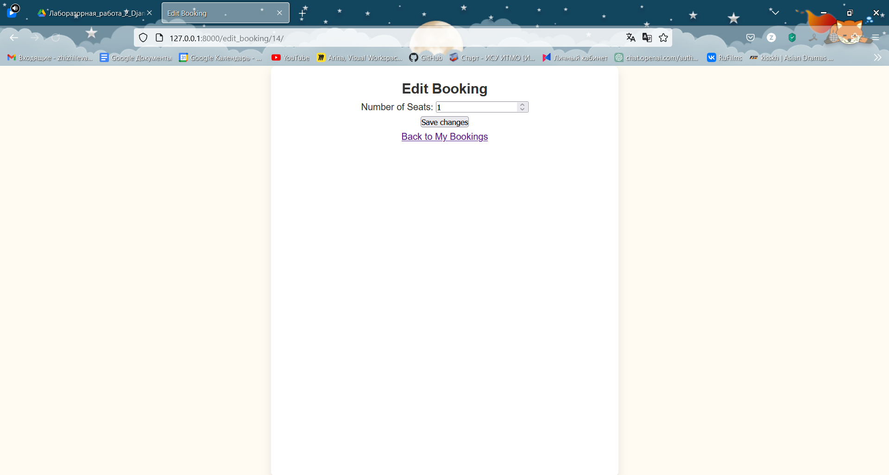
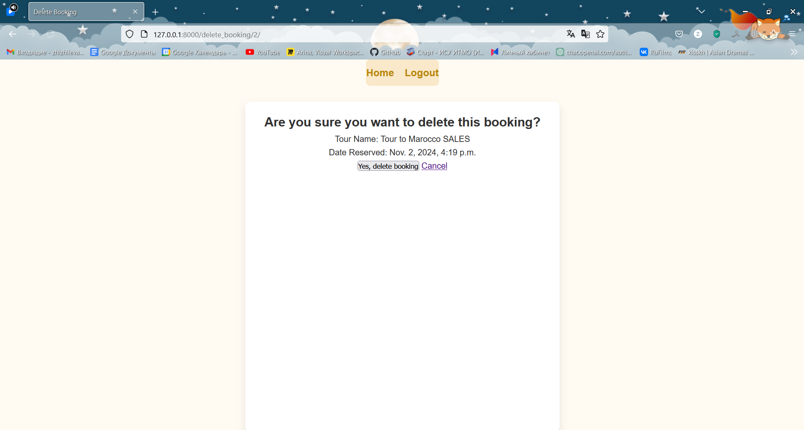
На главной странице мы можем увидеть проданные туры всех туристических фирм.
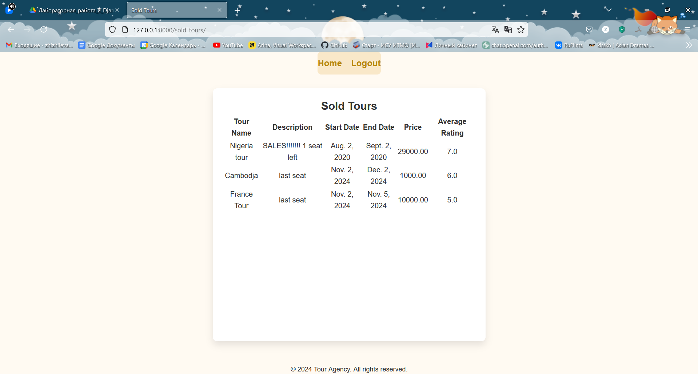
Через админку мы можем подтвердить брони кнопкой is confirmed
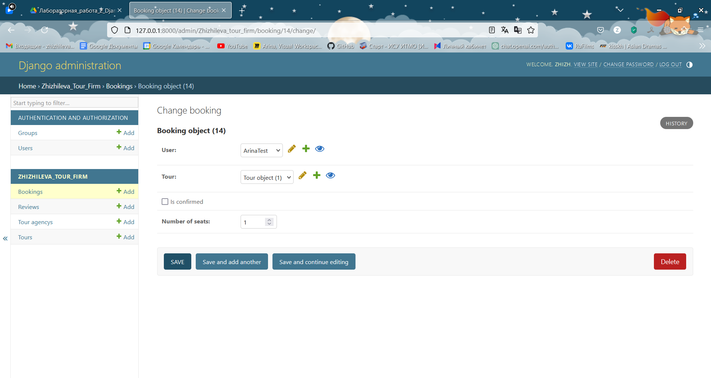
После бронирования тура, когда админ подтвердит наш тур, мы можем оставить отзыв, на странице тура появится кнопка оставить отзыв.
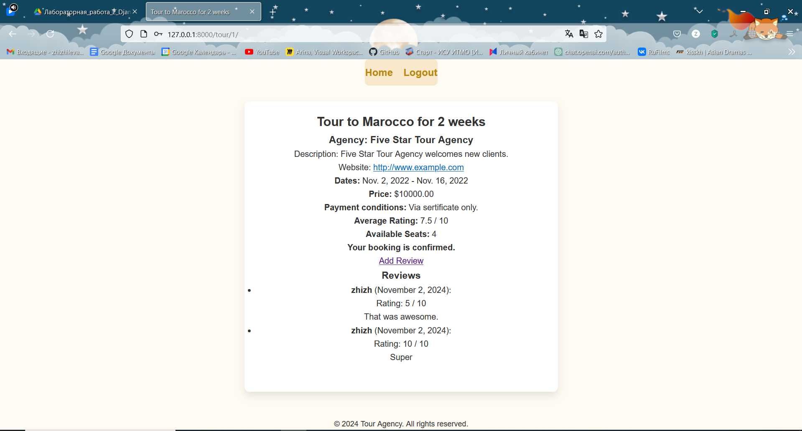
Форма для добавления отзыва.
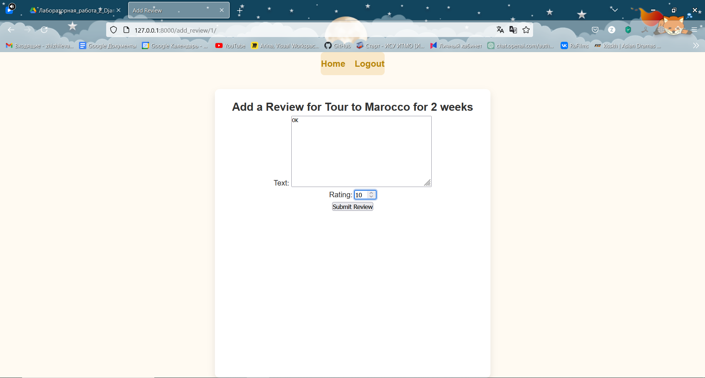
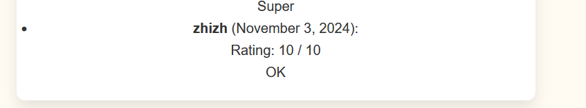